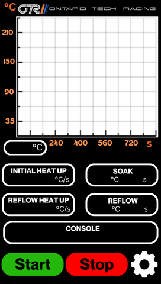
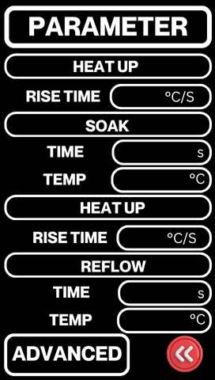

# Reflow Oven Control Software

This repository contains the source code for controlling a reflow oven using an STM32 microcontroller. The system is designed to manage the reflow process with precise temperature control and profile management, making it suitable for surface mount technology (SMT) soldering.





## Table of Contents
- [Introduction](#introduction)
- [Features](#features)
- [Project Structure](#project-structure)
- [Code Summary](#code-summary)
- [Dependencies](#dependencies)


## Introduction
The reflow oven control project uses an STM32 microcontroller to automate the reflow soldering process. It allows users to load temperature profiles, monitor the process, and control heating elements in real-time.

## Features
- Automated temperature control based on user-defined profiles
- Support for custom reflow profiles
- User interface integration with Nextion displays
- Real-time feedback on temperature and process status
- Safe handling of power failure and recovery

## Project Structure

| File/Folder                              | Description                                                                |
|------------------------------------------|----------------------------------------------------------------------------|
| `stm32/`                                 | Root folder containing the project files                                   |
| `stm32/Core/Inc/`                        | Header files for the core functionalities                                  |
| `stm32/Core/Src/`                        | Source files implementing core functionalities                             |
| `stm32/Drivers/STM32F1xx_HAL_Driver/`    | HAL driver files for the STM32F1xx microcontroller family                  |
| `stm32/Drivers/CMSIS/`                   | CMSIS libraries for ARM Cortex M3 processor                                |
| `stm32/Drivers/CMSIS/Device/ST/STM32F1xx`| STM32F1xx-specific device files                                            |
| `stm32/libs/`                            | Libraries used in the project                                              |

## Code Summary

<details>
  <summary><code>Core/Src/main.c</code></summary>
  
# Detailed Code Summary for main.c

This is a summary of the `main.c` file used in the reflow oven control system based on STM32. Below is a breakdown of each section, including relevant code snippets and explanations for key functionalities.

## File Description: `Core/Src/main.c`

<details>
  <summary>Overview</summary>
  The `main.c` file is the entry point of the application. It initializes the hardware peripherals and handles the core loop that controls the reflow oven process.

  **Main Responsibilities:**
  - Initialize hardware (GPIO, SPI, Timers, UART)
  - Configure system clock
  - Run the infinite loop that executes the reflow oven logic
</details>

<details>
  <summary>Detailed Explanation</summary>

# Detailed Step-by-Step Explanation of main.c

This guide provides a detailed explanation of every function and major lines of code in the `main.c` file. It covers peripheral initialization, callbacks, and main control logic for the reflow oven system.
The code snippets attached are commented for the explanation.

## 1. File Header and License Information

```c
/* USER CODE BEGIN Header */
/**
 *****************************************************************************
 * @file           : main.c
 * @brief          : Main program body
 *****************************************************************************
 * @attention
 * All rights reserved.
 *
 * This software component is licensed by ST under BSD 3-Clause license.
 *****************************************************************************
 */
```
- **What It Does**: This section contains the standard file header for the main program file. It includes license details and a brief description of the file.

## 2. Includes Section

```c
#include "main.h"
#include "globVars.h"
```
- **What It Does**: 
  - `main.h`: This includes the main definitions and function declarations for peripheral initialization and core functionality.
  - `globVars.h`: This includes global variables shared across different parts of the project.

## 3. Private Variables Declaration

```c
SPI_HandleTypeDef hspi1;
TIM_HandleTypeDef htim1;
TIM_HandleTypeDef htim4;
UART_HandleTypeDef huart1;
```
- **What It Does**: These are the handles for the peripherals used:
  - `hspi1`: SPI1 instance for communicating with devices like sensors.
  - `htim1`: Timer 1 used for generating PWM signals to control the heating elements.
  - `htim4`: Timer 4 used for timing events like temperature measurement intervals.
  - `huart1`: UART1 used for serial communication, which can be used to communicate with external devices like a computer or display.

## 4. Global Variables

```c
uint8_t data[2];  // Used for SPI data reception.
uint8_t ReflowCurve[4000];  // Stores the reflow temperature curve.
float temp;  // Stores the current temperature value.
float duty;  // Stores the current PWM duty cycle value.
uint32_t data_flash[] = { 400, 200, 0, 50, 900, 2 };  // Example data for flash storage.
arm_pid_instance_f32 PID;  // PID controller instance.
ReflowTemplate ReflowParameters;  // Reflow parameters template.
uint8_t ReflowEnable = 0;  // Flag to enable the reflow process.
uint16_t ReflowIndex = 0;  // Index for traversing the reflow curve.
float32_t debug = 0;  // Debug variable for testing purposes.
uint8_t Cmd_End[] = { 0xFF, 0xFF, 0xFF };  // Command end marker for UART communication.
uint8_t UART_Recieved_Data[5] = { 'p', '0', 'x', 'x', 'x' };  // Buffer for UART received data.
uint8_t UART_Recieved_Flag = 0;  // Flag indicating UART data has been received.
char input[20];  // Buffer for user input via UART.
uint16_t PhaseIndex[] = { 0, 0, 0, 0, 0 };  // Indices representing different phases of the reflow process.
char ConsoleMSG[20];  // Buffer for console messages.
uint8_t TempDrawEnable = 0;  // Flag for enabling temperature drawing on the screen.
uint32_t TempDrawCounter = 0;  // Counter for drawing temperature data at intervals.
```

## 5. Main Function

```c
int main(void) {
    HAL_Init();  // Initialize the Hardware Abstraction Layer (HAL)
    SystemClock_Config();  // Configure the system clock
    MX_GPIO_Init();  // Initialize GPIOs
    MX_SPI1_Init();  // Initialize SPI1
    MX_TIM4_Init();  // Initialize Timer 4
    MX_TIM1_Init();  // Initialize Timer 1 for PWM
    MX_USART1_UART_Init();  // Initialize UART1

    // Start timers and PWM
    HAL_TIM_Base_Start_IT(&htim4);  // Start Timer 4 with interrupts
    HAL_TIM_PWM_Start(&htim1, TIM_CHANNEL_1);  // Start Timer 1 in PWM mode for heating control

    htim1.Instance->CCR1 = 10;  // Set PWM duty cycle to 10%

    HAL_Delay(2000);  // Initial delay for system stabilization

    // Setup UART reception with interrupt
    HAL_UART_Receive_IT(&huart1, UART_Recieved_Data, 5);
    sprintf(ConsoleMSG, "IDLE");  // Initialize system state to "IDLE"

    // Update display and draw reflow curve
    Update_Page_0();  // Function to refresh the Nextion display
    Draw_Reflow_Curve();  // Function to draw the temperature profile curve on the display

    while (1) {
        HandleGui();  // Process user interface updates (e.g., buttons, screen commands)
        HAL_Delay(500);  // Main loop delay for processing
        if (strncmp((char*) UART_Recieved_Data, "p0xxx", 5) == 0) {
            debug = 5;  // If specific command is received via UART, set debug flag
        }
    }
}
```
- **What It Does**: 
  - The main function initializes all the hardware peripherals (GPIO, SPI, TIM, UART), starts the timers and PWM, and enters an infinite loop where the system continuously processes user input, updates the GUI, and monitors the temperature.

## 6. Callback: `void HAL_TIM_PeriodElapsedCallback(TIM_HandleTypeDef *htim)`

```c
void HAL_TIM_PeriodElapsedCallback(TIM_HandleTypeDef *htim) {
    TempDrawCounter++;  // Increment drawing counter

    if (htim == &htim4) {  // If the interrupt is triggered by Timer 4
        HAL_GPIO_WritePin(CS_GPIO_Port, CS_Pin, 0);  // Enable SPI communication
        HAL_SPI_Receive(&hspi1, data, 2, 100);  // Read temperature data from sensor via SPI
        HAL_GPIO_WritePin(CS_GPIO_Port, CS_Pin, 1);  // Disable SPI communication
        temp = ((((uint16_t) data[1] << 8) | data[2]) >> 3) * 0.249;  // Calculate temperature from raw data

        if (ReflowEnable == 1) {  // If reflow process is enabled
            // Display the current phase of the reflow process
            if (ReflowIndex == PhaseIndex[0]) sprintf(ConsoleMSG, "HEAT UP");
            if (ReflowIndex == PhaseIndex[1]) sprintf(ConsoleMSG, "SOAK");
            if (ReflowIndex == PhaseIndex[2]) sprintf(ConsoleMSG, "HEAT UP");
            if (ReflowIndex == PhaseIndex[3]) sprintf(ConsoleMSG, "REFLOW");
            if (ReflowIndex == PhaseIndex[4]) sprintf(ConsoleMSG, "COOL DOWN");

            // Perform PID control based on temperature error
            float pid_error = ReflowCurve[ReflowIndex + 1] - temp;  // Calculate the error between desired and actual temperature
            duty = arm_pid_f32(&PID, pid_error);  // Use PID controller to calculate duty cycle

            // Limit duty cycle to prevent over/under-heating
            if (duty > 1000) { duty = 1000; PID.Ki = 0; }
            else if (duty < 0) { duty = 0; }
            else { PID.Ki = ReflowParameters.Ki; }

            htim1.Instance->CCR1 = (uint16_t) duty;  // Apply duty cycle to PWM for heating

            ReflowIndex++;  // Move to the next point in the reflow profile

            if (ReflowIndex == PhaseIndex[4]) {  // If the last phase is reached, finish the process
                sprintf(ConsoleMSG, "FINISHED");
                ReflowEnable = 0;
            }
        } else {
            ReflowIndex = 0;  // Reset index if reflow is not enabled
            htim1.Instance->CCR1 = 0;  // Set duty cycle to 0, stopping heating
        }
    }
}
```
- **What It Does**: This callback is triggered by Timer 4 and performs temperature measurement, reflow process control, and updates the GUI during the reflow process.

## 7. Peripheral Initialization Functions

```c
void SystemClock_Config(void) { /*...*/ }
static void MX_SPI1_Init(void) { /*...*/ }
static void MX_TIM4_Init(void) { /*...*/ }
static void MX_TIM1_Init(void) { /*...*/ }
static void MX_USART1_UART_Init(void) { /*...*/ }
```
- **What They Do**: These functions initialize each peripheral (SPI, Timer, UART) with specific configurations for the reflow oven system.

## 8. Error Handling

```c
void Error_Handler(void) {
    __disable_irq();  // Disable interrupts to prevent further issues
    while (1) { }
}
```
- **What It Does**: This function handles system errors by halting the program and disabling interrupts to prevent further damage.

</details>


</details>

<details>
  <summary><code>Core/Src/FLASH_PAGE.c</code></summary>
 

# Step-by-Step Instructions for FLASH_PAGE.c

This guide provides detailed, actionable instructions on how to use and recreate the functionality provided by the `FLASH_PAGE.c` file. It explains each function and the necessary commands or operations related to flash memory.

## File Description: `Core/Src/FLASH_PAGE.c`

<details>
  <summary>Overview</summary>
  The `FLASH_PAGE.c` file handles operations for reading from, writing to, and erasing flash memory pages in the STM32 microcontroller. These operations are critical for saving and retrieving settings or profiles, such as the reflow temperature curves in the oven system.
</details>

<details>
  <summary>Detailed Instructions</summary>

### Includes
```c
#include "FLASH_PAGE.h"
#include "stm32f1xx_hal.h"
```
- **What to Do**: Make sure these files are included in your project.
  - `FLASH_PAGE.h`: The header file declares the functions used for flash memory operations.
  - `stm32f1xx_hal.h`: Provides access to the STM32 HAL libraries, enabling low-level flash memory control.

### Function: `FLASH_PageErase`
```c
HAL_StatusTypeDef FLASH_PageErase(uint32_t PageAddress) {
    HAL_StatusTypeDef status;
    FLASH_EraseInitTypeDef EraseInitStruct;
    uint32_t PageError;

    HAL_FLASH_Unlock();  // Unlock the Flash memory for erasing

    EraseInitStruct.TypeErase = FLASH_TYPEERASE_PAGES;
    EraseInitStruct.PageAddress = PageAddress;
    EraseInitStruct.NbPages = 1;

    status = HAL_FLASHEx_Erase(&EraseInitStruct, &PageError);  // Erase the page

    HAL_FLASH_Lock();  // Lock the Flash memory after erasing

    return status;
}
```
- **What It Does**: Erases a single page of flash memory located at `PageAddress`.
- **Step-by-Step**:
  1. **Unlock Flash Memory**: `HAL_FLASH_Unlock()` unlocks the memory, allowing write and erase operations.
  2. **Set Erase Parameters**: You define the page address and specify that only one page will be erased (`NbPages = 1`).
  3. **Erase Page**: The function `HAL_FLASHEx_Erase` erases the specified page. You can check the `status` and `PageError` to ensure successful operation.
  4. **Lock Flash Memory**: After erasing, lock the memory using `HAL_FLASH_Lock()` to prevent unintended writes.
- **Recreate**: Use this function whenever you need to clear data from a specific flash memory page, such as when resetting settings or profiles.

### Function: `FLASH_WriteData`
```c
HAL_StatusTypeDef FLASH_WriteData(uint32_t StartPageAddress, uint32_t *Data, uint16_t numberofwords) {
    HAL_StatusTypeDef status = HAL_OK;

    HAL_FLASH_Unlock();  // Unlock Flash memory for writing

    for (uint16_t i = 0; i < numberofwords; i++) {
        status = HAL_FLASH_Program(FLASH_TYPEPROGRAM_WORD, StartPageAddress + (i * 4), Data[i]);
        if (status != HAL_OK) {
            break;
        }
    }

    HAL_FLASH_Lock();  // Lock the Flash memory after writing

    return status;
}
```
- **What It Does**: Writes data from an array (`Data`) into flash memory starting at `StartPageAddress`.
- **Step-by-Step**:
  1. **Unlock Flash Memory**: Use `HAL_FLASH_Unlock()` to enable writing.
  2. **Iterate Over Data**: For each word in the `Data` array, use `HAL_FLASH_Program` to write it to flash memory. The address is calculated as `StartPageAddress + (i * 4)`, where `i` is the index and 4 is the size of each word (32 bits).
  3. **Error Handling**: If an error occurs during writing (`status != HAL_OK`), the process stops and the error is returned.
  4. **Lock Flash Memory**: After writing, lock the flash memory using `HAL_FLASH_Lock()`.
- **Recreate**: This function is useful when you need to store persistent data, such as temperature profiles or settings, in non-volatile memory.

### Function: `FLASH_ReadData`
```c
void FLASH_ReadData(uint32_t StartPageAddress, uint32_t *RxBuf, uint16_t numberofwords) {
    for (uint16_t i = 0; i < numberofwords; i++) {
        RxBuf[i] = *(volatile uint32_t *)(StartPageAddress + (i * 4));
    }
}
```
- **What It Does**: Reads data from flash memory and stores it into the `RxBuf` buffer.
- **Step-by-Step**:
  1. **Direct Memory Access**: The function uses pointer arithmetic to directly access flash memory and copy the contents into `RxBuf`. The memory address is calculated as `StartPageAddress + (i * 4)` for each word.
  2. **Store Data in Buffer**: Each word of data is read and stored into the corresponding position in `RxBuf`.
- **Recreate**: Use this function to retrieve stored data from flash memory, such as when loading saved settings or profiles.

</details>


</details>

<details>
  <summary><code>Core/Src/nextionGraphics.c</code></summary>

# Step-by-Step Instructions for nextionGraphics.c

This guide provides detailed, actionable instructions on how to use and recreate the functionality provided by the `nextionGraphics.c` file. It explains each function and the necessary commands to be sent to the Nextion display module for controlling the reflow oven user interface.

## File Description: `Core/Src/nextionGraphics.c`

<details>
  <summary>Overview</summary>
  The `nextionGraphics.c` file handles communication with the Nextion display, which is the main user interface for the reflow oven system. The code sends commands to update the display, sends text, and handles initialization over UART.
</details>

<details>
  <summary>Detailed Instructions</summary>

### Includes
```c
#include "nextionGraphics.h"
#include "stm32f1xx_hal.h"
```
- **What to Do**: Ensure these files are included in your project.
  - `nextionGraphics.h` declares the functions for interacting with the Nextion display.
  - `stm32f1xx_hal.h` gives access to the STM32 HAL libraries for UART communication.

### Function: `Nextion_SendString`
```c
void Nextion_SendString(char *ID, char *string) {
    char buf[50];
    sprintf(buf, "%s.txt="%s"", ID, string);
    HAL_UART_Transmit(&huart1, (uint8_t *)buf, strlen(buf), 100);
    HAL_UART_Transmit(&huart1, (uint8_t *)"ÿÿÿ", 3, 100);  // End command
}
```
- **What It Does**: Sends a string to a specific text field on the Nextion display.
- **Command to Send**: 
  - The command format is `ID.txt="string"`. 
  - For example, to set the text field with ID `"t0"` to display `"Hello"`, you would send the command: `t0.txt="Hello"`.
- **How It Works**:
  - The command is sent to the display over UART using `HAL_UART_Transmit`.
  - The `ÿÿÿ` sequence must be appended to the command to signify its end.
- **Recreate**: Ensure UART is configured and linked to the Nextion display and the `Nextion_SendString` function is called whenever you want to update a text field.

### Function: `Nextion_RefreshDisplay`
```c
void Nextion_RefreshDisplay(void) {
    // Function to refresh the display or update relevant screen elements
}
```
- **What It Does**: This function would be used to refresh the Nextion display or update multiple elements at once.
- **What to Send**: 
  - This will likely involve sending multiple commands to update different UI elements, such as text fields, buttons, or progress bars.
  - For instance, updating a text field might involve `t1.txt="New Value"`, and updating a progress bar might involve `j0.val=50`.
- **Recreate**: Implement commands that update the key elements of the display in one function to ensure the display is always synchronized with the system’s state.

### Function: `Nextion_SendCommand`
```c
void Nextion_SendCommand(char *command) {
    HAL_UART_Transmit(&huart1, (uint8_t *)command, strlen(command), 100);
    HAL_UART_Transmit(&huart1, (uint8_t *)"ÿÿÿ", 3, 100);  // End command
}
```
- **What It Does**: Sends a custom command to the Nextion display.
- **Command to Send**: 
  - You can send any valid Nextion command using this function. For example, to change the display page to page 1, you would send the command: `page 1`.
- **Recreate**: Use this function to send any general command that the Nextion display recognizes. Don’t forget to append `ÿÿÿ` at the end of each command.

### Function: `Nextion_Init`
```c
void Nextion_Init(void) {
    Nextion_SendCommand("page 0");  // Set initial page
}
```
- **What It Does**: Initializes the Nextion display by sending a startup command.
- **Command to Send**: 
  - To set the initial page on the display to page 0, send the command `page 0`.
  - Other initialization commands could include setting default values for text fields or progress bars.
- **Recreate**: Call this function on system startup to ensure the display starts at the correct page and has all elements set to their initial values.

</details>


</details>

<details>
  <summary><code>Core/Src/reflowMath.c</code></summary>

# Step-by-Step Instructions for reflowMath.c

This guide provides detailed, actionable instructions on how to use and recreate the functionality provided by the `reflowMath.c` file. It explains each function and the calculations used to control the reflow oven's heating profile.

## File Description: `Core/Src/reflowMath.c`
<details>
  <summary>Overview</summary>
- This file contains the mathematical functions necessary for creating the temperature profile used in the reflow oven process. It manages the generation of the reflow curve, as well as the calculation of PID control for the heating system.
</details>
<details>
  <summary>Detailed Instructions</summary>

## 1. Includes Section

```c
#include "reflowMath.h"
#include "main.h"
```
- **What It Does**: 
  - `reflowMath.h`: The header file that declares the functions implemented in `reflowMath.c`.
  - `main.h`: Provides access to the global variables and functions defined in the main system file.

## 2. Global Variables

```c
extern ReflowTemplate ReflowParameters;  // Reflow template that holds the parameters for the reflow process.
extern uint8_t ReflowCurve[4000];  // The reflow curve that represents the temperature profile.
```
- **What They Do**:
  - `ReflowParameters`: This structure holds the key parameters like temperature setpoints and timing for each phase of the reflow process.
  - `ReflowCurve`: Stores the temperature data points that define the reflow curve (temperature profile over time).

## 3. Function: `calculateReflowCurve`

```c
void calculateReflowCurve(void) {
    float startTemp = ReflowParameters.StartTemp;
    float soakTemp = ReflowParameters.SoakTemp;
    float reflowTemp = ReflowParameters.ReflowTemp;
    float coolTemp = ReflowParameters.CoolTemp;
    uint16_t soakTime = ReflowParameters.SoakTime;
    uint16_t reflowTime = ReflowParameters.ReflowTime;
    uint16_t coolTime = ReflowParameters.CoolTime;

    // Set up the curve for heating up
    for (int i = 0; i < soakTime; i++) {
        ReflowCurve[i] = startTemp + ((soakTemp - startTemp) * i) / soakTime;
    }

    // Soaking phase
    for (int i = soakTime; i < soakTime + reflowTime; i++) {
        ReflowCurve[i] = soakTemp + ((reflowTemp - soakTemp) * (i - soakTime)) / reflowTime;
    }

    // Cooling down phase
    for (int i = soakTime + reflowTime; i < soakTime + reflowTime + coolTime; i++) {
        ReflowCurve[i] = reflowTemp + ((coolTemp - reflowTemp) * (i - soakTime - reflowTime)) / coolTime;
    }
}
```
- **What It Does**: This function calculates the temperature profile (reflow curve) based on the setpoints and timing parameters provided in `ReflowParameters`.
- **Step-by-Step**:
  1. **Initialize Temperature Variables**: Start, soak, reflow, and cool temperatures are assigned from `ReflowParameters`.
  2. **Generate Soak Curve**: The system calculates the temperature increase during the soaking phase by linearly interpolating between `startTemp` and `soakTemp`.
  3. **Generate Reflow Curve**: The temperature ramps up from `soakTemp` to `reflowTemp` during the reflow phase.
  4. **Generate Cool Down Curve**: Finally, the system generates a cool-down curve that brings the temperature from `reflowTemp` to `coolTemp`.
  
  This curve is stored in `ReflowCurve` and will be used to control the heating elements in the reflow oven.

## 4. Function: `setReflowParameters`

```c
void setReflowParameters(void) {
    // Example of setting the default values for the reflow parameters
    ReflowParameters.StartTemp = 25;  // Start temperature (room temp)
    ReflowParameters.SoakTemp = 150;  // Soaking temperature
    ReflowParameters.ReflowTemp = 230;  // Peak reflow temperature
    ReflowParameters.CoolTemp = 100;  // Cool down temperature
    ReflowParameters.SoakTime = 180;  // Time to reach soaking temperature (in seconds)
    ReflowParameters.ReflowTime = 60;  // Time to reach reflow temperature (in seconds)
    ReflowParameters.CoolTime = 120;  // Time for cooling down (in seconds)
    ReflowParameters.KP = 1.0;  // PID proportional gain
    ReflowParameters.Ki = 0.1;  // PID integral gain
    ReflowParameters.KD = 0.05;  // PID derivative gain
}
```
- **What It Does**: This function sets the default reflow parameters that will be used to create the reflow temperature profile.
- **Step-by-Step**:
  1. **Set Temperatures**: Initializes the starting temperature, soaking temperature, reflow temperature, and cool down temperature.
  2. **Set Timing**: Configures the time duration for each phase (soaking, reflow, and cooling).
  3. **Set PID Gains**: Sets the gains for the PID controller, which will be used to regulate the temperature during the reflow process.

## 5. Function: `calculatePID`

```c
float calculatePID(float setpoint, float currentTemp) {
    static float lastError = 0;
    static float integral = 0;

    float error = setpoint - currentTemp;
    integral += error;  // Integral of error over time
    float derivative = error - lastError;  // Rate of change of error

    // PID formula: output = KP * error + Ki * integral + KD * derivative
    float output = (ReflowParameters.KP * error) + 
                   (ReflowParameters.Ki * integral) + 
                   (ReflowParameters.KD * derivative);

    lastError = error;  // Update lastError for the next calculation

    return output;
}
```
- **What It Does**: This function calculates the control output for the heating element based on the difference between the desired temperature (setpoint) and the current temperature using a PID controller.
- **Step-by-Step**:
  1. **Calculate Error**: Compute the error between the desired temperature (`setpoint`) and the current temperature (`currentTemp`).
  2. **Integral Calculation**: Add the error to the integral to account for accumulated error over time.
  3. **Derivative Calculation**: Compute the rate of change of error (how fast the error is changing).
  4. **Apply PID Formula**: Use the PID formula to compute the output, which will be used to adjust the heating element's duty cycle.

## 6. Error Handling: `Error_Handler`

```c
void Error_Handler(void) {
    while (1) {
        // Infinite loop in case of system errors
    }
}
```
- **What It Does**: This function is executed when an error occurs in the system. It enters an infinite loop to stop further operation until the error is resolved.

</details>

</details>

<details>
  <summary><code>Core/Inc/globVars.h</code></summary>
Step-by-Step Instructions for globVars.h

This guide provides detailed, actionable instructions on how to use and understand the global variables declared in the `globVars.h` file. It explains the purpose of each variable and how it is used across the reflow oven system.

## File Description: `Core/Inc/globVars.h`
<details>
  <summary>Overview</summary>
This file contains global variables that are shared across multiple files in the reflow oven control system. These variables include the reflow process parameters, control flags, and buffers for communication and temperature tracking.
  
</details>

<details>
  <summary>Detailed</summary>
Detailed Step-by-Step Explanation of globVars.h

This guide provides a detailed explanation of every global variable and major lines of code in the `globVars.h` file. It covers global variables used throughout the reflow oven system.

## 1. Includes Section

```c
#include "arm_math.h"
#include "reflowMath.h"
```
- **What It Does**: 
  - `arm_math.h`: This header file provides access to ARM's CMSIS-DSP library, used for mathematical operations like PID control.
  - `reflowMath.h`: This file contains function declarations for the math functions related to reflow curve calculation and PID control.

## 2. Data Structures and Typedefs

```c
typedef struct {
    float StartTemp;
    float SoakTemp;
    float ReflowTemp;
    float CoolTemp;
    uint16_t SoakTime;
    uint16_t ReflowTime;
    uint16_t CoolTime;
    float KP;
    float Ki;
    float KD;
} ReflowTemplate;
```
- **What It Does**: This `ReflowTemplate` structure holds all the parameters needed for a complete reflow process. It includes:
  - **Temperatures**: Starting, soaking, reflow, and cooling temperatures.
  - **Timing**: Duration for each phase of the reflow process (soak, reflow, cool down).
  - **PID Gains**: Parameters for the PID controller, which regulates the heating element's power.

## 3. Global Variables

### Reflow Template and Curve
```c
extern ReflowTemplate ReflowParameters;
extern uint8_t ReflowCurve[4000];
```
- **What They Do**:
  - `ReflowParameters`: Stores the settings for the current reflow process (temperatures, timings, and PID gains).
  - `ReflowCurve`: An array that holds the calculated temperature points for the reflow curve. This is used to control the oven's temperature over time.

### UART Communication
```c
extern uint8_t UART_Recieved_Data[5];
extern uint8_t UART_Recieved_Flag;
```
- **What They Do**:
  - `UART_Recieved_Data`: Buffer that stores data received over UART communication.
  - `UART_Recieved_Flag`: A flag indicating that new data has been received over UART.

### PID Control
```c
extern arm_pid_instance_f32 PID;
```
- **What It Does**: This variable represents the PID controller instance from the ARM CMSIS library, used to compute the heating element's duty cycle based on the reflow profile.

## 4. Other Variables

### Debugging and Console Output
```c
extern char ConsoleMSG[20];
extern float32_t debug;
```
- **What They Do**:
  - `ConsoleMSG`: Stores messages that will be displayed on the system console or screen.
  - `debug`: A float variable used for debugging purposes to track and test values.

### Temperature Drawing and Tracking
```c
extern uint8_t TempDrawEnable;
extern uint32_t TempDrawCounter;
```
- **What They Do**:
  - `TempDrawEnable`: A flag that determines whether temperature data should be drawn on the display.
  - `TempDrawCounter`: A counter that keeps track of the number of times temperature data has been drawn.

### Phase Tracking for the Reflow Process
```c
extern uint16_t PhaseIndex[5];
extern uint16_t ReflowIndex;
```
- **What They Do**:
  - `PhaseIndex`: An array used to mark the start and end points of each phase in the reflow process (e.g., heat up, soak, reflow, cool down).
  - `ReflowIndex`: Keeps track of the current position in the reflow curve during the process.

### Control Flags
```c
extern uint8_t ReflowEnable;
```
- **What It Does**: A flag used to enable or disable the reflow process. When this flag is set, the system will start executing the reflow temperature control loop.

## 5. Command Data
```c
extern uint8_t Cmd_End[3];
```
- **What It Does**: This array stores the command termination sequence (0xFF, 0xFF, 0xFF), which is sent at the end of every command during UART communication with external devices like the Nextion display.
</details>

</details>

## Dependencies
- STM32CubeMX (for project setup)
- STM32 HAL library
- CMSIS for ARM Cortex-M microcontrollers


